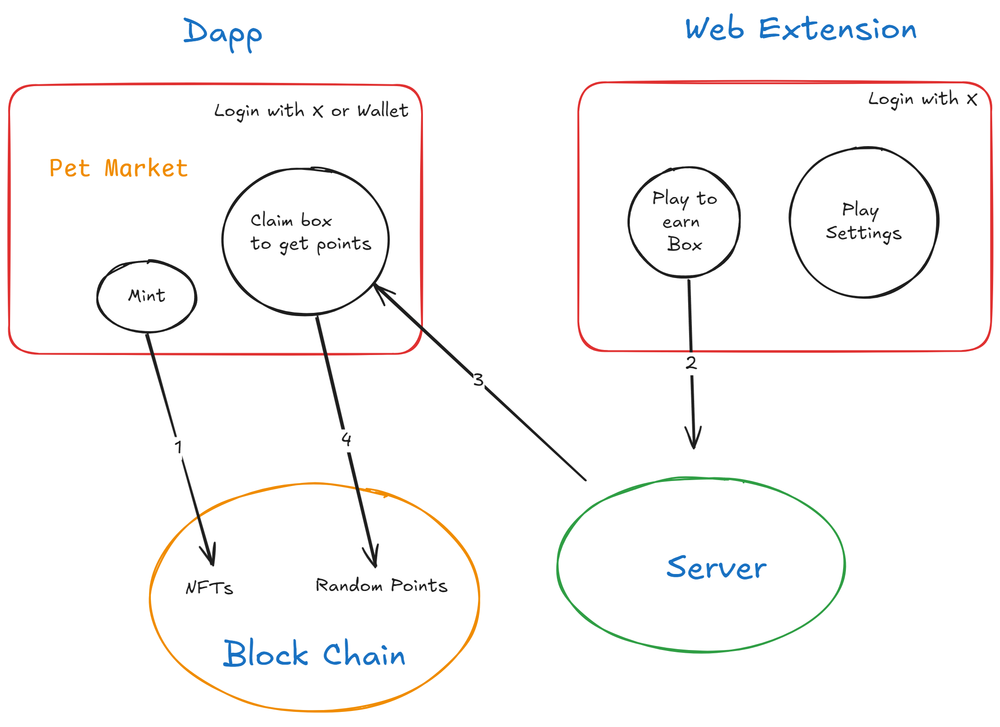

# Pet3
[Dapp link](https://pet3-fawn.vercel.app/)
A virtual pet chrome extension on block chain

# Install
1. Download from [Release page](https://github.com/Wujerry/Pet3/releases/) and drag it into Chrome.
2. Open [Chrome Extension Page](chrome://extensions/) ``chrome://extensions/``.
3. Enable Developer Mode by clicking the toggle switch next to Developer mode.
4. Drag zip file to Chrome.

# How to play
1. Mint your pet NFT in [Dapp link](https://pet3-fawn.vercel.app/)
2. Drag the pet to hit the hidden lucky box
3. Open the box in Dapp to get $PET

# Box
There is a hidden lucky box that randomly generate on the screen, if the pet collides with it, you will get a lucky box

# RoadMap
- More pets, maybe Pepe, Doge, etc.
- Pets Market
- Custom pet with head, arm and leg
- Upgrade the NFT Level


# How to contribue


### File Structure
```javascript
 - contract // contract floder
 - dapp // dapp floder, write in react and next.js
 - webext // web extension floder
 - doc // document floder
```